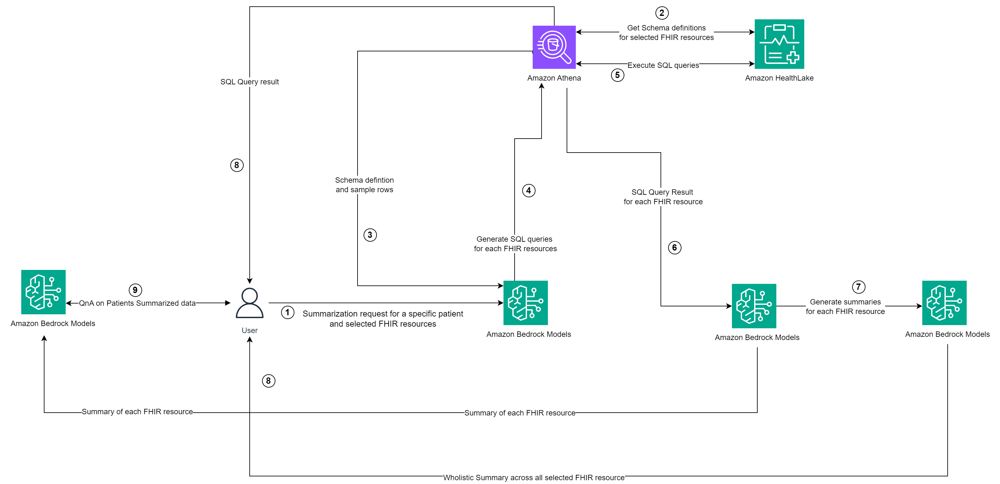
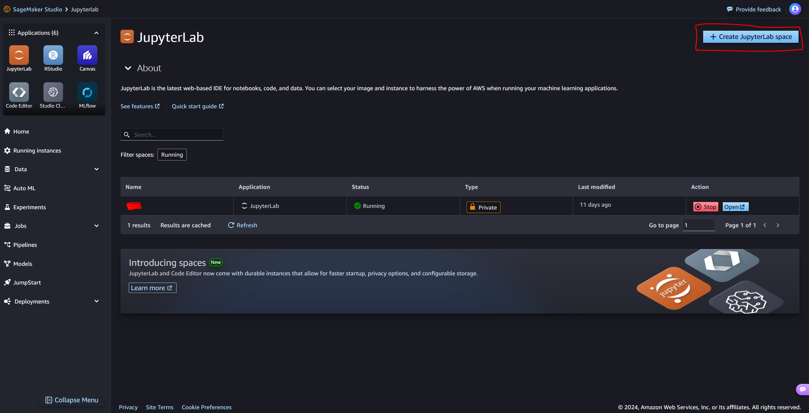
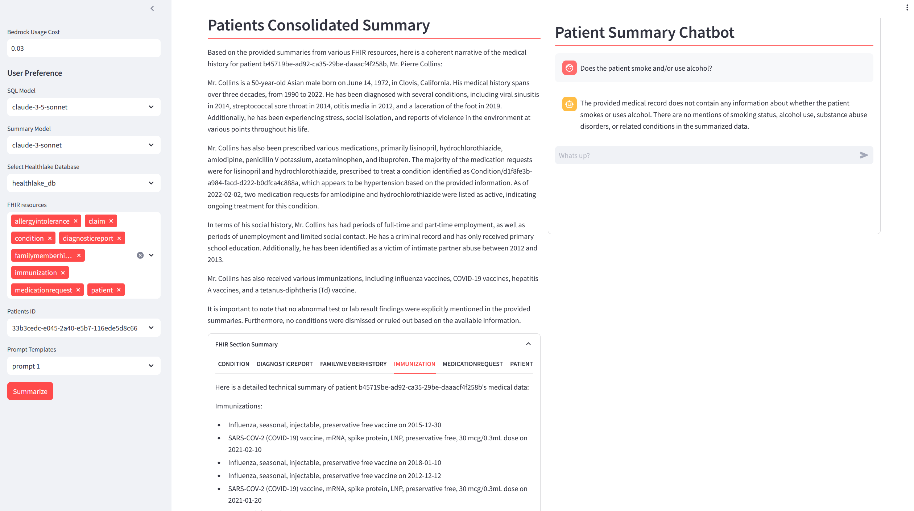

# Extract Medical Insights from Amazon HealthLake with Bedrock 
This project utilizes Amazon Bedrock to summarize patient data stored in Amazon HealthLake. It allows users to interact with their HealthLake database, retrieve patient information, and generate consolidated summaries of patient medical histories.

## Features

- Database Integration: Connect to your Amazon HealthLake database and select the desired Fast Healthcare Interoperability Resources (FHIR) to analyze.
- Patient Selection: Choose a specific patient ID from the available list.
- Prompt Templates: Select from predefined prompt templates to customize the summary generation process.
- Summarization: Generate detailed summaries of patient medical data by leveraging Amazon Bedrock's Generative AI capabilities.
- Consolidated Summary: Obtain a comprehensive, coherent summary of the patient's medical history by merging information from various FHIR resources.
- Individual FHIR summary: Obtain a more granular summary of each FHIR resource selected for analysis.
- Interactive Chat: Engage in a conversational interface to ask questions about the patient's medical record and receive relevant answers.
- Cost Tracking: Monitor the usage cost of Amazon Bedrock during the summarization process.

## Workflow

1. User Initiation:
    - The process begins with a user requesting summarization for a specific patient and selected FHIR resources.
2. Schema Retrieval:
    - Amazon Athena communicates with Amazon HealthLake to get schema definitions for the selected FHIR resources
3. Query Generation:
    - Amazon Bedrock Model receives the schema definition and sample rows from Athena.
    - It then generates SQL queries for each of the selected FHIR resources.
4. Query Execution:
    - The generated SQL queries are sent back to Amazon Athena.
    - Self-healing is enabled for debugging failed SQL execution. 
5. Data Retrieval:
    - Amazon Athena executes these SQL queries on the data stored in Amazon HealthLake.
6. Result Processing:
    - The SQL query results for each FHIR resource are sent to another instance of Amazon Bedrock Models.
7. Summary Generation:
    - Amazon Bedrock Model generates summaries for each FHIR resource based on the query results.
    - Amazon Bedrock Model genrates a consolidated summary across the FHIR resource summaries to provide a concise summary of the patient's medical history.
8. Data Return to User:
    - The summaries of each FHIR resource are sent back to the user.
    - Additionally, a wholistic summary across all selected FHIR resources is provided to the user.
    - SQL query results across each FHIR resources is sent back to the user for transperancy into the summary process.
9. Follow-up Interaction:
    - The user can perform question-answering (QnA) on the summarized patient (each FHIR resource summary) data using Amazon Bedrock Model.

This workflow demonstrates an efficient use of various AWS services to retrieve, process, and summarize healthcare data in FHIR format, providing users with both detailed and overview information about a patient's health records. Different Bedrock models can be used for each step that involves an LLM to optimize the worflow for speed and accuracy.

## Pre-Requisites
- Set up Amazon HealthLake in your account following this workshop [Population Health on AWS using AWS HealthLake](https://catalog.us-east-1.prod.workshops.aws/workshops/4849824d-084a-4a64-a237-f05027f54abc/en-US).
- [Bedrock Model Access for Anthropic Claude](https://docs.aws.amazon.com/bedrock/latest/userguide/model-access.html)

## Security Best Practices for Text 2 SQL Applications
When executing SQL queries especially those dynamically generated by an LLM based on a user query, it is mandatory to implement guardrails to prevent and or curb any security attacks on your application. Below are guidance from OWASSP and Amazon for SQL/Prompt Injection and security best practices for LLM applications:
1. [SQL Injection Prevention Cheat Sheet](https://cheatsheetseries.owasp.org/cheatsheets/SQL_Injection_Prevention_Cheat_Sheet.html)
2. [Prompt engineering best practices to avoid prompt injection attacks on modern LLMs](https://docs.aws.amazon.com/prescriptive-guidance/latest/llm-prompt-engineering-best-practices/introduction.html)

## Usage

**To run this Streamlit App on Sagemaker Studio follow the steps below:**

**Set Up SageMaker Studio Classic**
SageMaker execution role should have access to interact with Bedrock, S3 , Athena and HealtLake
If You have a sagemaker Studio Domain already set up, ignore the first item, however, item 2 is required.
* [Set Up SageMaker Studio Classic](https://docs.aws.amazon.com/sagemaker/latest/dg/onboard-quick-start.html) 
* SageMaker execution role should have access to interact with [Bedrock](https://docs.aws.amazon.com/bedrock/latest/userguide/api-setup.html), [S3](https://docs.aws.amazon.com/AmazonS3/latest/userguide/access-policy-language-overview.html), [Athena](https://docs.aws.amazon.com/athena/latest/ug/managed-policies.html) and [HealthLake](https://docs.aws.amazon.com/healthlake/latest/devguide/security-iam-awsmanpol.html).
* [Launch SageMaker Studio](https://docs.aws.amazon.com/sagemaker/latest/dg/studio-launch.html)
* [Clone this git repo into studio](https://docs.aws.amazon.com/sagemaker/latest/dg/studio-tasks-git.html)
* Open a system terminal by clicking on **Amazon SageMaker Studio** and then **System Terminal** as shown in the diagram below
* 
* Navigate into the cloned repository directory using the `cd` command and run the command `pip install -r requirements.txt` to install the needed python libraries.
* Run command `python3 -m streamlit run app_fhir.py` to start the Streamlit server. 
* To enter the Streamlit app, open and run the cell in the **StreamlitLink.ipynb** notebook. This will generate the appropiate link to enter your Streamlit app from SageMaker studio. Click on the link to enter your Streamlit app.
* **⚠ Note:**  If you rerun the Streamlit server it may use a different port. Take not of the port used (port number is the last 4 digit number after the last : (colon)) and modify the `port` variable in the `StreamlitLink.ipynb` notebook to get the correct link.

**Set Up SageMaker Studio JupyterLab**
SageMaker execution role should have access to interact with Bedrock, S3 , Athena and HealtLake
If You have a sagemaker Studio Domain already set up, ignore the first item, however, item 2 is required.
* [Set Up SageMaker Studio](https://docs.aws.amazon.com/sagemaker/latest/dg/studio-updated-launch.html) 
* SageMaker execution role should have access to interact with [Bedrock](https://docs.aws.amazon.com/bedrock/latest/userguide/api-setup.html), [S3](https://docs.aws.amazon.com/AmazonS3/latest/userguide/access-policy-language-overview.html), [Athena](https://docs.aws.amazon.com/athena/latest/ug/managed-policies.html) and [HealthLake](https://docs.aws.amazon.com/healthlake/latest/devguide/security-iam-awsmanpol.html).
* [Create a JupyterLab space](https://docs.aws.amazon.com/sagemaker/latest/dg/studio-updated-jl.html)
* 
* [Clone this git repo into studio](https://docs.aws.amazon.com/sagemaker/latest/dg/studio-updated-jl-admin-guide-git-attach.html)
* Open a terminal by clicking on **File** and then **New** and finally **Terminal**
* Navigate into the cloned repository directory using the `cd` command and run the command `pip install -r requirements.txt` to install the needed python libraries.
* Run command `python3 -m streamlit run app_fhir.py` to start the Streamlit server. 
* Copy the URL of the SageMaker JupyterLab. It should look something like this `https://qukigdtczjsdk.studio.us-east-1.sagemaker.aws/jupyterlab/default/lab/tree/healthlake/app_fhir.py`. Replace everything after `.../default/` with `proxy/8501/`, something like `https://qukigdtczjsdk.studio.us-east-1.sagemaker.aws/jupyterlab/default/proxy/8501/`. Make sure the port number (8501 in this case) matches with teh port number printed out when you run the `python3 -m streamlit run app_fhir.py`; port number is the last 4 digits after the colon in the generated URL.

**To run this Streamlit App on AWS EC2 (I tested this on the Ubuntu Image)**
* [Create a new ec2 instance](https://docs.aws.amazon.com/AWSEC2/latest/UserGuide/EC2_GetStarted.html)
* Expose TCP port range 8500-8510 on Inbound connections of the attached Security group to the ec2 instance. TCP port 8501 is needed for Streamlit to work. See image below
* 
* EC2 [instance profile role](https://docs.aws.amazon.com/IAM/latest/UserGuide/id_roles_use_switch-role-ec2_instance-profiles.html) has the required permissions to access the services used by this application mentioned above.
* [Connect to your ec2 instance](https://docs.aws.amazon.com/AWSEC2/latest/UserGuide/AccessingInstances.html)
* Run the appropiate commands to update the ec2 instance (`sudo apt update` and `sudo apt upgrade` -for Ubuntu)
* Clone this git repo `git clone [github_link]` and `cd extract-medical-insights-from-amazon-healthlake-with-bedrock`
* Install python3 and pip if not already installed, `sudo apt install python3` and `sudo apt install python3-pip`.
* Install the dependencies by running the following commands (use `yum` for Centos-OS or Amazon-Linux):
  - `pip install -r requirements.txt`
* Run command `tmux new -s mysession` to create a new session. Then in the new session created `cd extract-medical-insights-from-amazon-healthlake-with-bedrock` and run `python3 -m streamlit run app_fhir.py` to start the streamlit app. This allows you to run the Streamlit application in the background and keep it running even if you disconnect from the terminal session.
* Copy the **External URL** link generated and paste in a new browser tab.
* **⚠ NOTE:** The generated link is not secure! For [additional guidance](https://github.com/aws-samples/deploy-streamlit-app). 
To stop the `tmux` session, in your ec2 terminal Press `Ctrl+b`, then `d` to detach. to kill the session, run `tmux kill-session -t mysession`

## Application UI

**Configurable Parameters:**
1. `SQL Model`: Select the model for generating SQL
2. `Summary Model`: Select the model for generating aptient summary
3. `Select Healthlake Database`: Select the health lake database name
4. `FHIR Resources`: Select various FHIR resources to be used in the patient summary
5. `Patients ID`: Select the ID of the patient to get a summary on
6. `Prompt Templates`: Select the summary prompt template used by the LLM for generating patient summary

**The UI presents the following sections:**
1. A `Patients Consolidated Summary` pane that renders the final summary across all FHIR resources selected for analysis.
2. A `Patients Summary Chatbot` pane to perform QnA on the summaries generated for all individual FHIR resources.
3. An `FHIR Section Summary` pane that captures individual FHIR resource summary.
4. An `FHIR Section Tables` pane that shows the result of query execution against each FHIR resources.

## Limitations
1. The app is currently constarined to Anthropic Claude models on Amazon Bedrock and does not take advantage of other models available on Amazon Bedrock.
2. The app does not cache SQL query and their corresponding results for better performance and cost optimization.
3. The `pricing.json` file holds cost information for each model enabled in this application. It is a static file and will need manual updating to keep recent Amazon Bedrock model price information.

## License
For open source projects, say how it is licensed.

